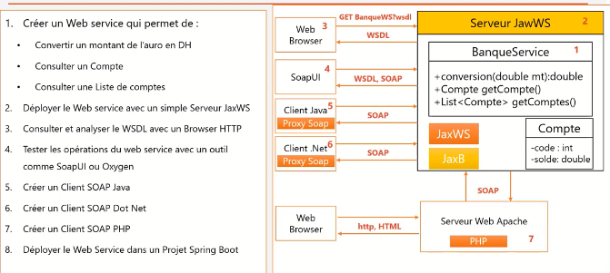
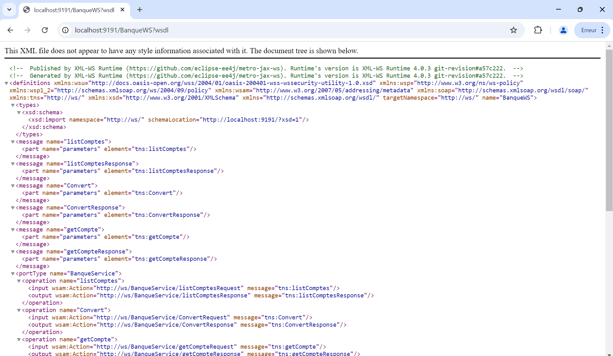
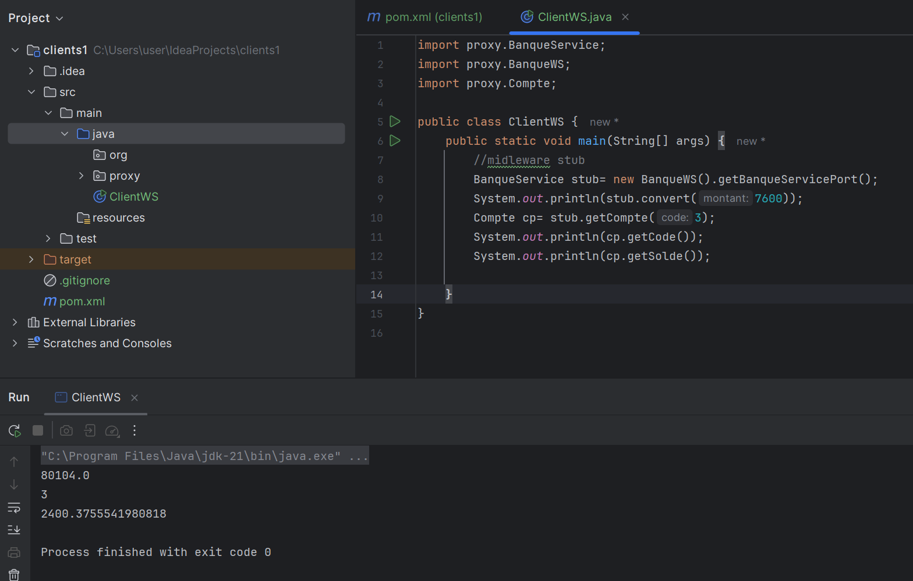

# README - Déploiement d’un Service Web avec JAX-WS

## Table des Matières
1. [Présentation du Projet](#présentation-du-projet)
2. [Structure du Projet](#structure-du-projet)
3. [Configuration du Serveur](#configuration-du-serveur)
4. [Test du Web Service](#test-du-web-service)
5. [WSDL et SoapUI](#wsdl-et-soapui)
6. [Génération de Proxy à partir du WSDL](#génération-de-proxy-à-partir-du-wsdl)

---

## Présentation du Projet

Ce projet présente un **service web simple en JAX-WS** qui expose des méthodes de conversion, de récupération de comptes et de liste de comptes. Le service est déployé avec un serveur autonome en utilisant la classe `Endpoint`.

---


## Structure du Projet

1. **`BanqueService`** : Classe principale du service web avec trois méthodes :
    - `conversion(double mt)` : Convertit un montant en appliquant un taux fixe.
    - `getCompte(int code)` : Retourne un compte avec un code spécifique.
    - `listComptes()` : Retourne une liste de plusieurs comptes.

2. **`Compte`** : POJO représentant un compte avec les attributs `code`, `solde`, et `dateCreation`. Le champ `dateCreation` est marqué avec **`@XmlTransient`** pour être ignoré dans la sérialisation XML.

3. **`ServerJWS`** : Classe permettant de déployer le web service en utilisant **`Endpoint.publish()`**.

---

## Configuration du Serveur

1. **Classe `BanqueService`** :  
   Voici la classe qui expose les méthodes en tant que web service :

   ```java
   package ws;

   import jakarta.jws.WebMethod;
   import jakarta.jws.WebParam;
   import jakarta.jws.WebService;

   import java.util.Date;
   import java.util.List;

   @WebService(serviceName = "BanqueWS")
   public class BanqueService {

       @WebMethod(operationName = "Convert")
       public double conversion(@WebParam(name = "montant") double mt) {
           return mt * 10.54;
       }

       @WebMethod
       public Compte getCompte(@WebParam(name = "code") int code) {
           return new Compte(code, Math.random() * 9888, new Date());
       }

       @WebMethod
       public List<Compte> listComptes() {
           return List.of(
               new Compte(1, Math.random() * 9888, new Date()),
               new Compte(2, Math.random() * 9888, new Date()),
               new Compte(3, Math.random() * 9888, new Date())
           );
       }
   }
   ```

2. **Classe `Compte`** :  
   Cette classe est un POJO utilisé pour représenter un compte bancaire. Le champ `dateCreation` est exclu de la sérialisation XML.

   ```java
   package ws;

   import jakarta.xml.bind.annotation.XmlAccessType;
   import jakarta.xml.bind.annotation.XmlAccessorType;
   import jakarta.xml.bind.annotation.XmlRootElement;
   import jakarta.xml.bind.annotation.XmlTransient;
   import java.util.Date;

   @XmlRootElement(name = "compte")
   @XmlAccessorType(XmlAccessType.FIELD)
   public class Compte {
       private int code;
       private double solde;

       @XmlTransient
       private Date dateCreation;

       public Compte() {}

       public Compte(int code, double solde, Date date) {
           this.code = code;
           this.solde = solde;
           this.dateCreation = date;
       }

       public int getCode() { return code; }
       public void setCode(int code) { this.code = code; }

       public double getSolde() { return solde; }
       public void setSolde(double solde) { this.solde = solde; }

       public Date getDateCreation() { return dateCreation; }
       public void setDateCreation(Date dateCreation) { this.dateCreation = dateCreation; }
   }
   ```

3. **Classe `ServerJWS`** :  
   Cette classe démarre le serveur et déploie le service web.

   ```java
   import jakarta.xml.ws.Endpoint;
   import ws.BanqueService;

   public class ServerJWS {
       public static void main(String[] args) {
           String url = "http://0.0.0.0:9191/";
           System.out.println("Déploiement du service web à l'adresse: " + url);
           Endpoint.publish(url, new BanqueService());
           System.out.println("Service web déployé avec succès.");
       }
   }
   ```

---

## Test du Web Service

1. **Lancer le Serveur** :  
   Compilez et exécutez la classe `ServerJWS`.  
   Le service sera accessible à l’adresse suivante :
   ```
   http://0.0.0.0:9191/BanqueWS?wsdl
   ```

2. **Vérifier le WSDL** :  
   Ouvrez l’URL suivante dans votre navigateur pour afficher le fichier WSDL :
   ```
   http://0.0.0.0:9191/?wsdl
   ```

---

## WSDL et SoapUI

1. **Créer un projet dans SoapUI** :
    - Ouvrez **SoapUI** et créez un **nouveau projet SOAP**.
    - Entrez l’URL du WSDL :
      ```
      http://0.0.0.0:9191/?wsdl
      ```
    - SoapUI chargera toutes les opérations disponibles depuis le service.

2. **Tester la méthode `Convert`** :
    - Envoyez une requête avec un **montant** de 100.

   Exemple de requête SOAP :
   ```xml
   <soapenv:Envelope xmlns:soapenv="http://schemas.xmlsoap.org/soap/envelope/" xmlns:ws="http://ws/">
      <soapenv:Header/>
      <soapenv:Body>
         <ws:Convert>
            <montant>100</montant>
         </ws:Convert>
      </soapenv:Body>
   </soapenv:Envelope>
   ```

   **Réponse attendue** :
   ```xml
   <soapenv:Envelope xmlns:soapenv="http://schemas.xmlsoap.org/soap/envelope/">
      <soapenv:Body>
         <ns2:ConvertResponse xmlns:ns2="http://ws/">
            <return>1054.0</return>
         </ns2:ConvertResponse>
      </soapenv:Body>
   </soapenv:Envelope>
   ```

---

## Génération de Proxy à partir du WSDL

Pour appeler le service à distance depuis un client Java, vous pouvez générer un **proxy** à partir du WSDL en utilisant l’outil **`wsimport`**.

1. **Commande `wsimport`** :
   ```bash
   wsimport -keep -verbose http://0.0.0.0:9191/?wsdl
   ```

2. **Utiliser le Proxy** :  
   Une fois le proxy généré, vous pouvez utiliser les classes créées pour invoquer les méthodes du service à distance.
   
---

## Conclusion

Vous avez maintenant un service web fonctionnel en **JAX-WS** avec :
- Déploiement via un serveur autonome.
- Fichier WSDL généré automatiquement.
- Test du service avec **SoapUI**.
- Option de génération de **proxy client** avec `wsimport`.

---

## Auteurs
- **BENELABDY MEROUANE**
